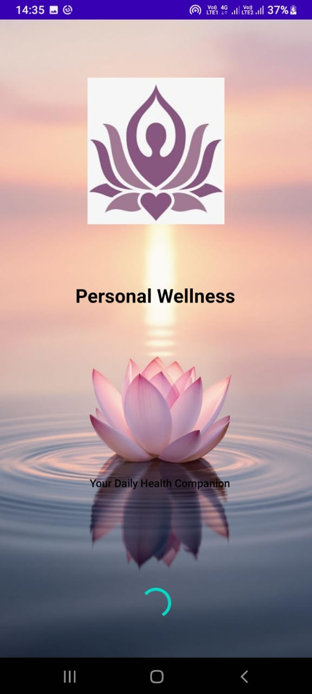

# Personal Wellness App (Android) 🌿✨

A dedicated mobile application built with **Kotlin** to help users track their mental and physical well-being. This app focuses on habit monitoring, mood tracking, and proactive task management through smart reminders.

---

### 🛠️ Technology Stack
* **Language:** Kotlin
* **Platform:** Android SDK
* **Design Pattern:** Repository Pattern for clean data handling
* **Storage:** SharedPreferences (Current)

### ✨ Key Features
* **Habit Tracker:** Effortlessly log and monitor daily habits to stay on track with personal goals.
* **Mood Logger:** Record and review emotional states with `MoodEntry` to gain insights into overall wellness.
* **Smart Reminders:** Integrated `ReminderScheduler` and `Receiver` to provide timely notifications for tasks.
* **Home Screen Widget:** Includes a custom `HabitWidget` for quick task visibility without opening the app.

### 📂 Architecture & Components
* `MainActivity.kt`: Manages the core user interface and app flow.
* `PreferenceRepository.kt`: Handles persistent data storage logic.
* `ReminderScheduler.kt`: Manages automated scheduling for user alerts.
* `Habit.kt` & `MoodEntry.kt`: Structured data models for consistent data management.

---

### 🚀 Current Status & Future Roadmap
* **Current Storage:** Currently using **SharedPreferences** for lightweight data persistence.
* **Next Update:** **SQLite/Room Database** integration is planned for more complex data relationships and offline capabilities. 🏗️
